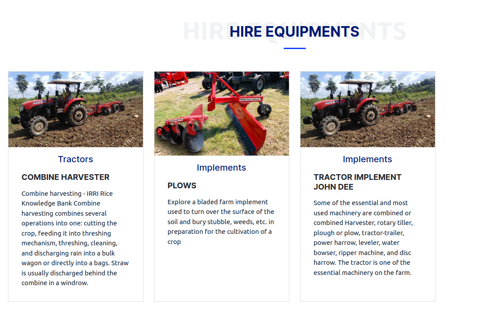

# Harvestsaver Network

  <a href="https://www.pysoftware.com" style="background-color:#4CAF50;color:white;padding:10px 20px;text-align:center;text-decoration:none;display:inline-block;font-size:16px;margin:4px 2px;cursor:pointer;border-radius:4px;">Live site</a>

## Table of Contents
- [Overview](#overview)
- [Features](#features)
- [Screenshots](#screenshots)
- [Live Demo](#live-demo)
- [Contributing](#contributing)
- [License](#license)
- [About](#about)

## Overview
This project is about reducing post harvest wastage. It provides
farmers with plantform where they can sell their farm produce.
It also provides farmers with farm equipments such as tructors
where they can hire from the owners. It offers services like
transport for products purchased or equipments hired.

## Features
- **User Authentication and Authorization:**
User can securely sign/login using our system.
(readme-img/register.png)

- **Payment Integration:**
Customers ahve the option to pay using stripe or farm pay service.
Farm pay service is in house service for payment and managing customer
payment data securely.

- **Transportation Services:**
Facilitate product transportation logistics, including features for
buying from farmers or equipment hiring.

- **Products Tracking:**
Track products through the supply chain, providing visibility from
production to delivery.

- **Real-time Data Analysis:**
Utilize real-time data from Open Weather and crop data for dynamic
analysis and insights.

- **API Integration:**
Provide an API for developers to integrate Harvestsaver Networks
with other systems or build custom applications.

## Live Demo
[Live Demo](https://www.pysoftware.com)

## License
This project is licensed under the MIT License - see the [LICENSE](LICENSE) file for details.

## Screenshots

## About
 - ### [LinkedIn](https://www.linkedin.com/in/dennis-musembi-83a18bb7/)
 - ### [Github](https://github.com/Dennismwendwa)
 - ### [Twitter](https://twitter.com/Dennismusembi1)
 - ### [Project github repository](https://github.com/Dennismwendwa/harvestsaver)

